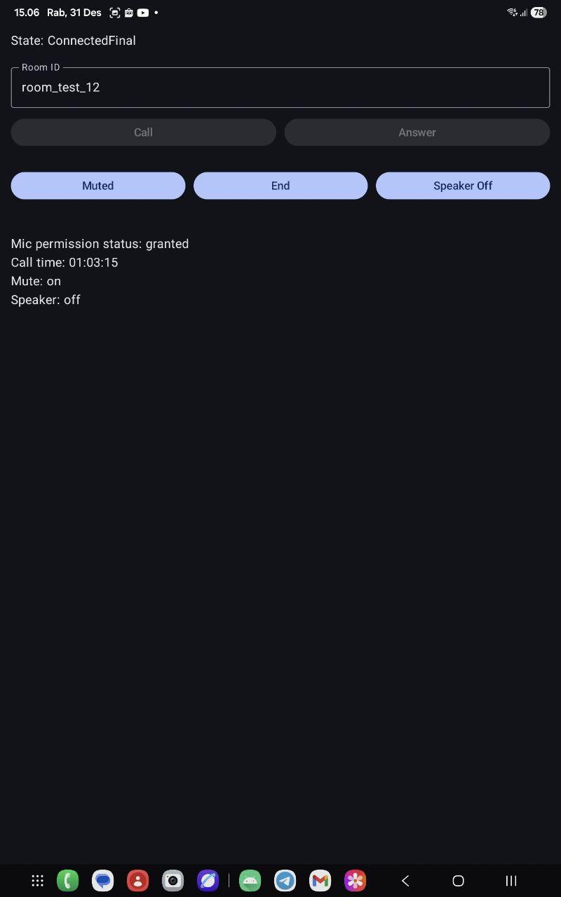

# JetCallLab
**Android WebRTC Audio Call Lab (Firestore Signaling + Foreground Service)**
JetCallLab is a **learning-oriented Android project** to explore how **real-time audio calls** work end-to-end using **WebRTC**, with a strong focus on:
- Signaling flow (Offer / Answer / ICE)
- Android lifecycle & background execution
- Resource management (audio, service, peer connection)
- Clean separation between UI, state, and call engine

> This project is not meant to be production-ready.  
> It is intentionally built as a **lab / playground** to understand how apps like WhatsApp, Telegram, Zoom, or Google Meet work under the hood.

---

## Table of Contents

1. [Features](#features)
2. [Project Structure](#project-structure)
3. [Core Components](#core-components)
4. [Tech Stack & Libraries](#tech-stack--libraries)
5. [How It Works (High Level)](#how-it-works-high-level)
6. [Firebase / Signaling Setup](#firebase--signaling-setup)
7. [How to Run](#how-to-run)
8. [Audio & Call Controls](#audio--call-controls)
9. [Lifecycle & Resource Management](#lifecycle--resource-management)
10. [ICE / STUN / TURN Notes](#ice--stun--turn-notes)
11. [Known Limitations](#known-limitations)
12. [Roadmap](#roadmap)
13. [License](#license)

---

## Features

- ✅ Peer-to-peer **audio call** using WebRTC
- ✅ **Firestore-based signaling** (Offer / Answer / ICE candidates)
- ✅ **Foreground Service** to keep calls alive when app is minimized
- ✅ **Call timer** (elapsed time)
- ✅ **Mute / Unmute**
- ✅ **Speaker On / Off**
- ✅ Safe cleanup to avoid memory & audio leaks

---

## UI Preview

> Minimal call playground UI (Caller/Callee) with timer + mute/speaker toggles.

<p align="center">
  
</p>

### What you can do
- Start as **Caller** or **Callee** using the same `roomId`
- Observe **call state** transitions
- See **call duration timer**
- Toggle **Mute / Speaker**
- Toggle **End**

---

## Project Structure
```
app/
└── src/main/java/id/yumtaufikhidayat/jetcalllab/
├── service/
│   └── CallService.kt            # Foreground Service: owns call lifecycle, timers, mute/speaker state
│
├── state/
│   └── CallState.kt              # Call state machine / UI states (Idle, Preparing, Connected, Failed, etc.)
│
├── ui/
│   ├── screen/
│   │   └── CallScreen.kt          # Compose UI screen (buttons: Call/Answer/End/Mute/Speaker)
│   └── theme/                     # Compose theme (colors, typography, shapes)
│
├── viewmodel/
│   └── CallViewModel.kt           # UI state holder; binds to CallService & exposes StateFlow to UI
│
├── utils/
│   ├── FirestoreSignaling.kt      # Signaling via Firestore (offer/answer + ICE candidates)
│   ├── WebRtcManager.kt           # WebRTC core (PeerConnection, ICE, audio track, speaker/mute controls)
│   └── LongExt.kt                 # Extensions (e.g., elapsed time formatting HH:MM:SS)
│
└── MainActivity.kt                # Android entry point; hosts Compose content
```

---

## Core Components

### `CallService`
- Runs the call session inside a **Foreground Service**
- Owns call lifecycle and audio routing
- Exposes `StateFlow`:
    - `CallState`
    - `elapsedSeconds`
    - `isMuted`
    - `isSpeakerOn`

### `WebRtcManager`
- Initializes WebRTC (`PeerConnectionFactory`, AudioDeviceModule)
- Handles:
    - ICE server configuration (STUN / TURN)
    - Offer / Answer creation
    - ICE candidate exchange
- Responsible for **full cleanup**:
    - PeerConnection
    - Audio tracks
    - Audio focus & routing

### `FirestoreSignaling`
- Signaling channel implementation using **Firebase Firestore**
- Stores:
    - Offer
    - Answer
    - Caller & Callee ICE candidates
- Acts only as **coordination layer**, not media transport

### `CallViewModel`
- Bridges **UI ↔ Service**
- Keeps UI logic simple (“dumb UI”)
- Collects state via `StateFlow`

### `CallScreen` (Jetpack Compose)
- Call / Answer / End
- Mute & Speaker toggle
- Timer & call state rendering

---

## Tech Stack & Libraries

### Core
- **Kotlin**
- **Jetpack Compose**
- **Coroutines & StateFlow**
- **Android Foreground Service**

### WebRTC
- `org.webrtc` (Google WebRTC SDK)
    - `PeerConnection`
    - `AudioTrack`
    - `ICE / SDP / RTP handling`

### Firebase
- **Firebase Firestore**
    - Used purely for signaling
    - No media data flows through Firestore

### Android Audio
- `AudioManager`
- `JavaAudioDeviceModule`
- Hardware Echo Cancellation & Noise Suppression (when available)

### Others
- Accompanist Permissions (mic permission)
- AndroidX Lifecycle & ViewModel

---

## How It Works (High Level)

1. **Signaling phase**
    - Caller creates SDP Offer
    - Offer is published to Firestore
    - Callee reads offer, creates SDP Answer
    - Answer is sent back via Firestore

2. **ICE negotiation**
    - Both peers exchange ICE candidates
    - STUN is tried first
    - TURN is used as fallback when NAT/firewall blocks direct connection

3. **Media transport**
    - Audio flows **directly peer-to-peer**
    - Signaling server is no longer involved

---

## Firebase / Signaling Setup

Firestore structure (conceptual):
```
rooms/{roomId}/offer
rooms/{roomId}/answer
rooms/{roomId}/callerCandidates/{autoId}
rooms/{roomId}/calleeCandidates/{autoId}
```
> ⚠️ For learning only.  
> Production apps **must** secure rules and authentication.

---

## How to Run

1. Prepare Firebase project & Firestore
2. Add `google-services.json` to `app/`
3. Install app on **two physical devices**
4. Use the **same roomId**
5. One device taps **Call**
6. The other taps **Answer**
7. Minimize app → call continues (Foreground Service)

---

## Audio & Call Controls

- **Mute**
    - `audioTrack.setEnabled(false)`
- **Speaker**
    - Controlled via `AudioManager.isSpeakerphoneOn`
- **Timer**
    - Based on `SystemClock.elapsedRealtime()`
    - Resilient to UI recreation

> Speaker & Bluetooth routing behavior may vary between devices.

---

## Lifecycle & Resource Management

On `endCall()`:
- Cancel coroutines & timeouts
- Remove Firestore listeners
- Close & dispose:
    - PeerConnection
    - AudioSource & AudioTrack
    - AudioDeviceModule
- Restore:
    - Audio mode
    - Speaker & Bluetooth state
- Abandon audio focus
- Stop foreground service

This prevents:
- Memory leaks
- Audio routing bugs
- Zombie background calls

---

## ICE / STUN / TURN Notes

- STUN works for simple NAT
- Corporate or restricted networks may block direct P2P
- TURN over **TCP/TLS 443** has the highest success rate
- Even with TURN, some networks may still block calls

> Intermittent connectivity on office WiFi is expected behavior.

---

## Known Limitations

- Learning project, not production-grade
- No authentication for signaling
- No ICE restart / reconnect logic
- Audio echo can occur when two devices are physically close

---

## Roadmap

- [ ] Incoming call notification
- [ ] ICE restart / reconnect
- [ ] Bluetooth SCO routing improvements
- [ ] Call quality metrics
- [ ] Secure signaling rules

---

## License

Private / learning project.  
Use at your own discretion.

