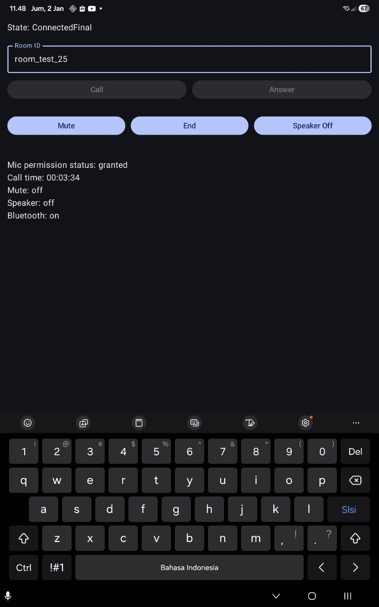
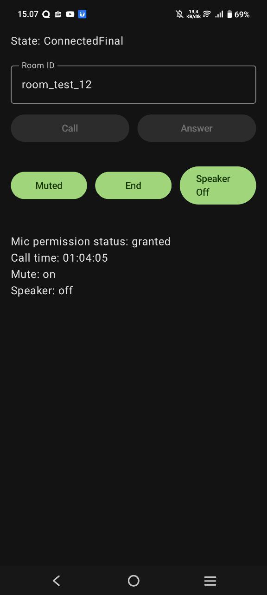
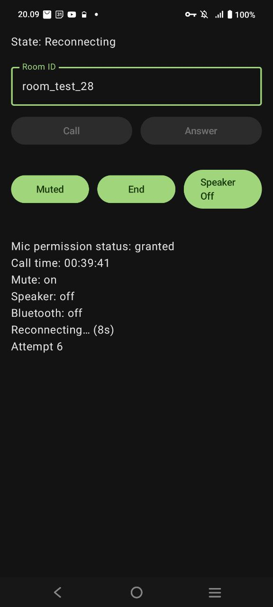

# JetCallLab
**Android WebRTC Audio Call Lab (Firestore Signaling + Foreground Service)**

JetCallLab is a **learning-oriented Android project** to explore how **real-time audio calls** work end-to-end using **WebRTC**, with a strong focus on:
- Signaling flow (Offer / Answer / ICE)
- Android lifecycle & background execution
- Audio routing (speaker, wired, Bluetooth SCO)
- Network instability handling & recovery
- Clean separation between UI, state, service, and call engine
> ⚠️ This project is not meant to be production-ready. It is intentionally built as a **lab / playground** to understand how apps like WhatsApp, Telegram, Zoom, or Google Meet work under the hood, especially under **imperfect network conditions**.

---

## Table of Contents

1. [Features](#features)
2. [UI Preview](#ui-preview)
3. [Project Structure](#project-structure)
4. [Core Components](#core-components)
5. [Tech Stack & Libraries](#tech-stack--libraries)
6. [How It Works (High Level)](#how-it-works-high-level)
7. [Firebase / Signaling Setup](#firebase--signaling-setup)
8. [How to Run](#how-to-run)
9. [Audio & Call Controls](#audio--call-controls)
10. [Reconnect & Network Recovery](#reconnect--network-recovery)
11. [Lifecycle & Resource Management](#lifecycle--resource-management)
12. [ICE / STUN / TURN Notes](#ice--stun--turn-notes)
13. [Known Limitations](#known-limitations)
14. [Roadmap](#roadmap)
15. [License](#license)

---

## Features

- ✅ Peer-to-peer **audio call** using WebRTC
- ✅ **Firestore-based signaling** (Offer / Answer / ICE candidates)
- ✅ **Foreground Service** keeps calls alive when app is backgrounded
- ✅ **Call timer** (elapsed time)
- ✅ **Mute / Unmute** toggle
- ✅ **Speaker On / Off** toggle
- ✅ Auto audio routing
     - Wired headset has highest priority
     - Bluetooth SCO auto-connect when earbuds/headset connected
     - Speaker enabled only via user toggle
     - Routing is re-evaluated when devices change
- ✅ Bluetooth active indicator
    - Derived from AudioManager + SCO state callbacks
    - Reflects actual audio route, not a UI toggle
- ✅ Network reconnect awareness
    - Detects ICE DISCONNECTED / FAILED
    - Emits Reconnecting state with attempt count & elapsed seconds
    - Automatically recovers call when ICE reconnects
- ✅ Safe cleanup
    - Prevents memory leaks, audio lockups, and zombie calls

---

## UI Preview

> Minimal call playground UI (Caller / Callee) with timer, mute/speaker toggles, reconnect indicator, and Bluetooth status.

<table border="0" cellspacing="0" cellpadding="0" style="border:none;border-collapse:collapse;">
  <br style="border:none;">
    <td align="center" style="border:none;padding:0 12px;">
      
      <br/>
      <sub><b>Device 1 (Tablet) as Caller</b></sub>
    </td>
    <td align="center" style="border:none;padding:0 12px;">
      
      <br/>
      <sub><b>Device 2 (Phone) as Callee/Answer</b></sub>
    </td>
    <br>
    <td align="center" style="border:none;padding:0 12px;">
      
      <br/>
      <sub><b>Device 1 (Tablet) as Caller</b></sub>
    </td>
    <td align="center" style="border:none;padding:0 12px;">
      
      <br/>
      <sub><b>Device 2 (Phone) as Callee/Answer</b></sub>
    </td>
</table>

### What you can do
- Start as **Caller** or **Callee** using the same `roomId`
- Observe **call state** transitions
- See **call duration timer**
- Toggle **Mute / Speaker**
- Toggle **End**

---

## Project Structure
```
app/
└── src/main/java/id/yumtaufikhidayat/jetcalllab/
├── enum/
│   └── AudioRoute.kt             # EARPIECE / SPEAKER (Bluetooth auto-detected)
│
├── service/
│   └── CallService.kt            # Foreground Service: owns call lifecycle, timers, audio & reconnect handling
│
├── state/
│   └── CallState.kt              # Call state machine (Idle, Preparing, ConnectedFinal, Reconnecting, Connected, Failed)
│
├── ui/
│   ├── screen/
│   │   └── CallScreen.kt          # Compose UI (Call/Answer/End/Mute/Speaker/Reconnect status)
│   └── theme/                     # Compose theme (colors, typography, shapes)
│
├── viewmodel/
│   └── CallViewModel.kt           # Bridges Service → UI via StateFlow
│
├── utils/
│   ├── FirestoreSignaling.kt      # Signaling via Firestore (Offer/Answer/ICE)
│   ├── WebRtcManager.kt           # WebRTC core + ICE handling + audio routing + reconnect logic
│   └── LongExt.kt                 # Time formatting helpers
│
└── MainActivity.kt                # Android entry point; hosts Compose content
```

---

## Core Components

### `CallService`
- Runs the call session inside a **Foreground Service**
- Owns:
  - Call lifecycle
  - Reconnect state propagation
  - Timer & audio state
- Exposes:
    - `state: StateFlow<CallState>`
    - `elapsedSeconds: StateFlow<Long>`
    - `isMuted: StateFlow<Boolean>`
    - `isSpeakerOn: StateFlow<Boolean>`
    - `isBluetoothActive: StateFlow<Boolean>`

### `WebRtcManager`
- WebRTC engine abstraction
- Responsibilities:
  - PeerConnection creation
  - ICE server configuration
  - Offer / Answer lifecycle
  - ICE candidate exchange
  - ICE state monitoring & reconnect detection
- Reconnect behavior:
  - Tracks whether call was ever connected
  - Emits Reconnecting on ICE failure
  - Emits Connected when ICE recovers
- Audio routing:
  - Wired → Bluetooth SCO → Speaker → Earpiece
  - Bluetooth is auto-routed, not toggled


### `FirestoreSignaling`
- Signaling channel implementation using **Firebase Firestore**
- Stores:
    - Offer
    - Answer
    - Caller & Callee ICE candidates
- Acts only as **coordination layer**, not media transport

### `CallViewModel`
- Bridges **UI ↔ Service**
- Keeps UI logic simple (“dumb UI”)
- Collects state via `StateFlow`

### `CallScreen` (Jetpack Compose)
- Call / Answer / End
- Mute & Speaker toggle
- Timer & call state rendering
- Bluetooth on/off indicator

---

## Tech Stack & Libraries

### Core
- **Kotlin**
- **Jetpack Compose**
- **Coroutines & StateFlow**
- **Android Foreground Service**

### WebRTC
- `org.webrtc` (Google SDK)
    - `PeerConnection`
    - `AudioTrack`
    - `ICE / SDP / RTP handling`

### Firebase
- **Firebase Firestore**
    - Used purely for signaling
    - No media data flows through Firestore

### Android Audio
- `AudioManager`
- `JavaAudioDeviceModule`
- Hardware Echo Cancellation & Noise Suppression (when available)
- Bluetooth SCO routing (device dependent)

### Others
- Accompanist Permissions (mic permission)
- AndroidX Lifecycle & ViewModel

---

## How It Works (High Level)

1. **Signaling phase**
    - Caller creates SDP Offer
    - Offer is published to Firestore
    - Callee reads offer, creates SDP Answer
    - Answer is sent back via Firestore

2. **ICE negotiation**
    - Both peers exchange ICE candidates
    - STUN is tried first
    - TURN is used as fallback when NAT/firewall blocks direct connection

3. **Media transport**
    - Audio flows **directly peer-to-peer**
    - Signaling server is no longer involved

---

## Firebase / Signaling Setup

Firestore structure (conceptual):
```
rooms/{roomId}/offer
rooms/{roomId}/answer
rooms/{roomId}/callerCandidates/{autoId}
rooms/{roomId}/calleeCandidates/{autoId}
```
> ⚠️ For learning only.  
> Production apps **must** secure rules and authentication.

---

## How to Run

1. Prepare Firebase project & Firestore
2. Add `google-services.json` to `app/`
3. Install app on **two physical devices**
4. Use the **same roomId**
5. One device taps **Call**
6. The other taps **Answer**
7. Minimize app → call continues (Foreground Service)
8. Connect Bluetooth earbuds/headset → audio will auto-route (device dependent)

---

## Audio & Call Controls

- **Mute**
    - `audioTrack.setEnabled(false)`

- **Speaker**
    - Controlled via `AudioRoute` + `AudioManager.isSpeakerphoneOn`

- **Bluetooth (Auto)**
    - Bluetooth is **not manually toggled**
    - If a Bluetooth SCO device is detected:
        - App requests SCO automatically
        - System routes audio to the device
    - UI indicator reflects **actual SCO connection state**
        - `true` = SCO connected
        - `false` = disconnected or unavailable

- **Timer**
    - Based on `SystemClock.elapsedRealtime()`
    - Safe across UI recreation


---

## Reconnect & Network Recovery

JetCallLab does not guarantee seamless reconnection, but it demonstrates how apps detect and react to network instability.

### Observed & Tested Scenarios
- WiFi → airplane mode → WiFi
- WiFi → cellular → WiFi
- Temporary network loss during active call

### Behavior
1. ICE enters DISCONNECTED / FAILED
2. Call emits Reconnecting(attempt, elapsedSeconds)
3. UI & foreground notification reflect reconnecting state
4. When ICE becomes CONNECTED again:
   - Audio resumes
   - State transitions to Connected
   - Call timer continues

> This is best-effort recovery, relying on WebRTC ICE behavior.
> No explicit ICE restart is performed.

---

## Lifecycle & Resource Management

On `endCall()`:
- Cancel coroutines & timeouts
- Remove Firestore listeners
- Close & dispose:
    - PeerConnection
    - AudioSource & AudioTrack
    - AudioDeviceModule
- Restore:
    - Audio mode
    - Speaker & Bluetooth state
- Abandon audio focus
- Stop foreground service

This prevents:
- Memory leaks
- Audio routing bugs
- Zombie background calls

---

## ICE / STUN / TURN Notes

- STUN works for simple NAT
- Corporate or restricted networks may block direct P2P
- TURN over **TCP/TLS 443** has the highest success rate
- Even with TURN, some networks may still block calls

> Intermittent connectivity on office WiFi is expected behavior.

---

## Known Limitations

- Learning project, **not production-grade**
- No authentication or security rules for signaling
- No explicit ICE restart (restartIce())
- No PeerConnection rebuild on hard failure
- Reconnect success depends heavily on:
  - Network type
  - TURN availability
  - OEM WebRTC behavior
- Audio echo can occur when devices are physically close
- Bluetooth SCO behavior varies a lot across OEM (some require manual user interaction)

---

## Roadmap

- [x] Bluetooth SCO auto-routing
- [x] Reconnect state & recovery indicator
- [x] Explore proximity sensor-based screen dimming during calls
- [ ] Explicit ICE restart support
- [ ] PeerConnection rebuild on unrecoverable failure
- [ ] Incoming call notification
- [ ] Call quality / ICE metrics dashboard
- [ ] Secure signaling rules

---

## License

Private / learning project.  
Use at your own discretion.

