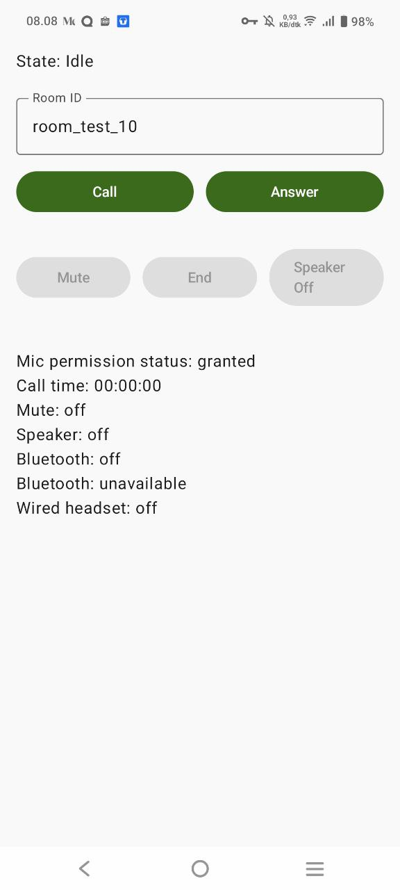
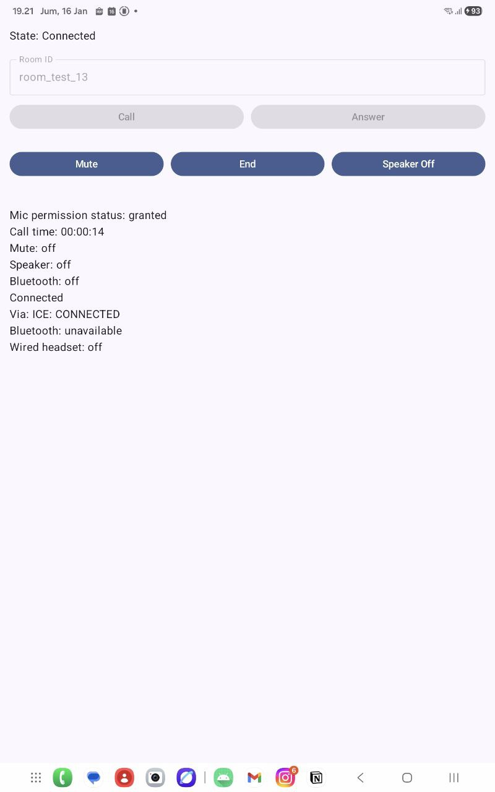
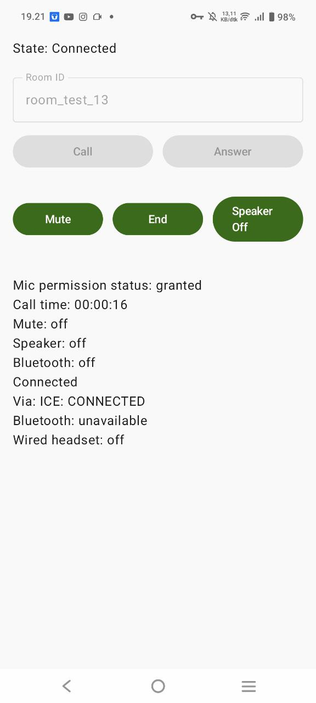
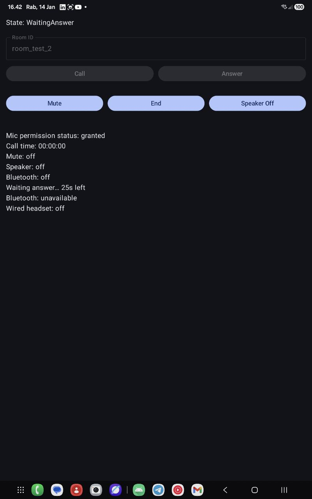
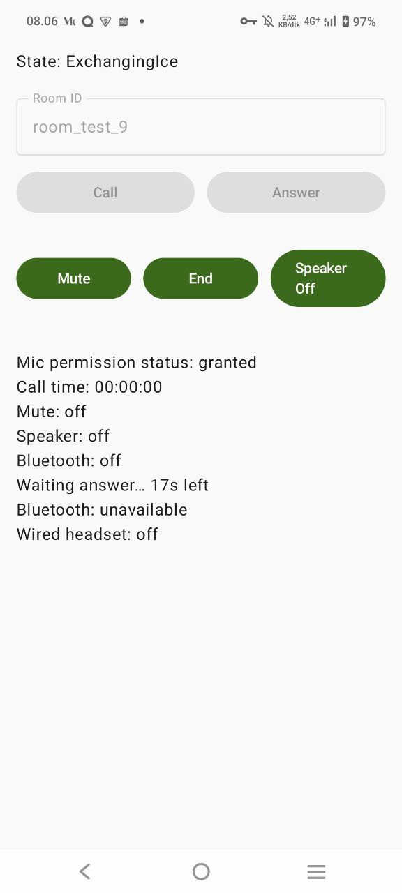
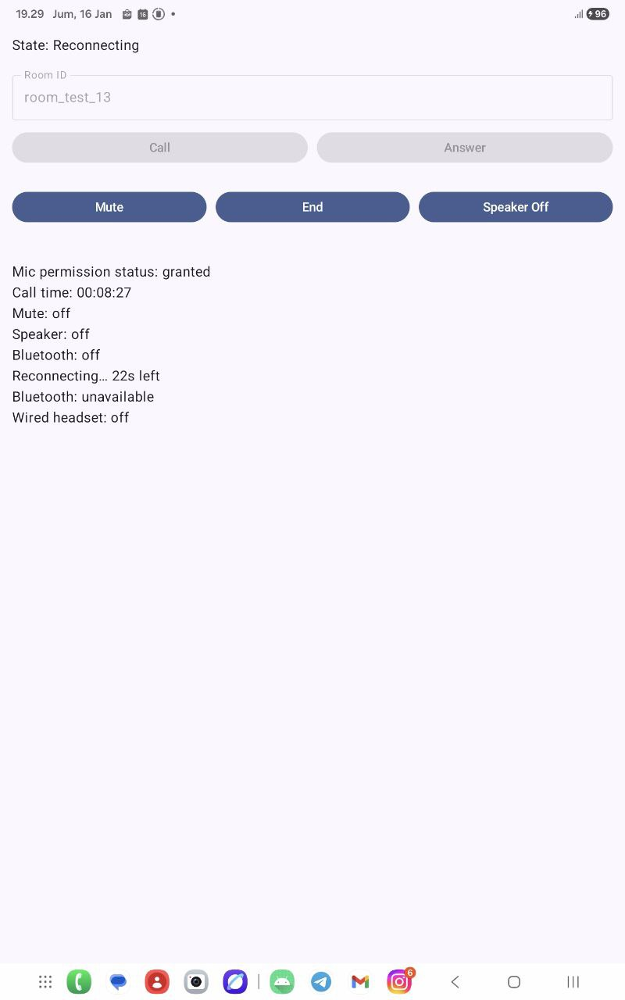
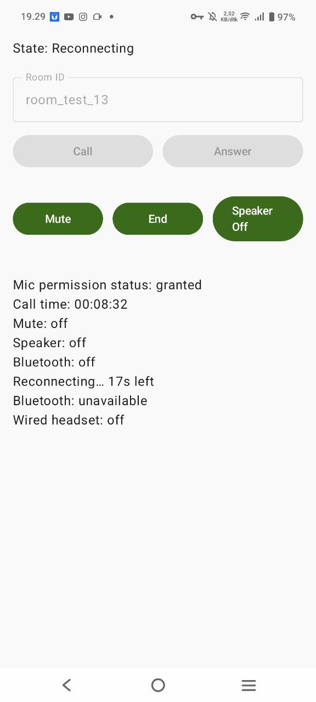

# JetCallLab
**Android WebRTC Audio Call Lab (Firestore Signaling + Foreground Service)**

JetCallLab is a **learning-oriented Android project** to explore how **real-time audio calls** work end-to-end using **WebRTC**, with a strong focus on:
- Signaling flow (Offer / Answer / ICE)
- Android lifecycle & background execution
- Audio routing (speaker, wired, Bluetooth SCO)
- Call progress feedback (connecting / reconnecting tones)
- In-call UX behavior (proximity screen off)
- Network instability handling & recovery
- Clean separation between UI, state, service, and call engine
> ⚠️ This project is not meant to be production-ready. It is intentionally built as a **lab / playground** to understand how apps like WhatsApp, Telegram, Zoom, or Google Meet work under the hood, especially under **imperfect network conditions**.

---

## Table of Contents

1. [Features](#features)
2. [UI Preview](#ui-preview)
3. [Project Structure](#project-structure)
4. [Core Components](#core-components)
5. [Tech Stack & Libraries](#tech-stack--libraries)
6. [How It Works (High Level)](#how-it-works-high-level)
7. [Firebase / Signaling Setup](#firebase--signaling-setup)
8. [How to Run](#how-to-run)
9. [Audio & Call Controls](#audio--call-controls)
10. [Call Tones](#call-tones)
11. [Proximity & In-Call Screen Behavior](#proximity--in-call-screen-behavior)
12. [Reconnect & Network Recovery](#reconnect--network-recovery)
13. [Lifecycle & Resource Management](#lifecycle--resource-management)
14. [ICE / STUN / TURN Notes](#ice--stun--turn-notes)
15. [Known Limitations](#known-limitations)
16. [Roadmap](#roadmaps)
17. [License](#license)

---

## Features

- ✅ Peer-to-peer **audio call** using WebRTC
- ✅ **Firestore-based signaling** (Offer / Answer / ICE candidates)
- ✅ **Foreground Service** keeps calls alive when app is backgrounded
- ✅ **Call timer** (elapsed time)
- ✅ **Mute / Unmute** toggle
- ✅ **Speaker On / Off** toggle
- ✅ Auto audio routing
     - Wired headset has highest priority
     - Bluetooth SCO auto-connect when a compatible device is detected
     - Speaker enabled only via user toggle (explicit intent)
     - Routing is re-evaluated when devices change
- ✅ Bluetooth active indicator (more realistic than a UI toggle)
    - `isBluetoothAvailable` = device exists / detected
    - `isBluetoothActive` = SCO is actually connected
- ✅ Call Tones
    - Audio ringtone is running well while waiting answer (connecting)
    - Plays a looping tone while **WaitingAnswer / ExchangingIce**
    - Plays a different looping tone while **Reconnecting**
    - Stops automatically on **Connected / End / Fail**
- ✅ Proximity screen-off behavior (in-call UX)
    - Uses proximity sensor + `PROXIMITY_SCREEN_OFF_WAKE_LOCK`
    - Enabled only for **in-call earpiece mode**
    - Automatically releases on speaker/Bluetooth/wired headset
- ✅ Network reconnect awareness (best effort)
    - Detects `ICE DISCONNECTED / FAILED`
    - Emits `Reconnecting state with attempt count & elapsed seconds`
    - Returns to `Connected` when ICE recovers
- ✅ Safe cleanup
    - Prevents memory leaks, listener leaks, audio lockups, and zombie calls

---

## UI Preview

> Minimal call playground UI (Caller / Callee) with timer, mute/speaker toggles, reconnect indicator, and Bluetooth status.

| Condition                | Caller                                                                 | Callee                                                                   |
|:-------------------------|:-----------------------------------------------------------------------|:-------------------------------------------------------------------------|
| Idle                     |                      |                      |
| In call (Success)        |                 |                 |
| In call (Waiting Answer) |  |  |
| Reconnecting             |         |         |

### What you can do
- Start as **Caller** or **Callee** using the same `roomId`
- Observe **call state** transitions
- See **call duration timer**
- Toggle **Mute / Speaker**
- Toggle **End**

---

## Project Structure
---
```
app/
└── src/main/java/id/yumtaufikhidayat/jetcalllab/
├── enum/
│   ├── AudioRoute.kt          # EARPIECE / SPEAKER (Bluetooth auto-detected)
│   ├── CallRole.kt            # CALLER / CALLEE role in a call session
│   ├── RoutePreference.kt     # Routing intention: AUTO vs SPEAKER (explicit user intent)
│   ├── TempoPhase.kt          # CONNECTING / RECONNECTING phase for timer & UX
│   └── ToneType.kt            # CONNECTING / RECONNECTING tone types
│
├── ext/
│   └── LongExt.kt             # Time formatting helpers (e.g. elapsedSeconds → HH:mm:ss)
│
├── model/
│   └── CallTempo.kt           # Model representing call timer state (elapsed, remaining, timeout)
│
├── service/
│   └── CallService.kt         # Foreground Service:
│                              # - Call lifecycle
│                              # - Timer & tempo handling
│                              # - Tone playback coordination
│                              # - Proximity coordination
│
├── state/
│   └── CallState.kt           # Call state machine
│                              # (Idle, Preparing, CreatingOffer,
│                              #  WaitingAnswer, ConnectedFinal,
│                              #  Reconnecting, FailedFinal, Ending)
│
├── ui/
│   └── screen/
│       └── CallScreen.kt      # Compose UI (dumb UI):
│                              # Call / Answer / End / Mute / Speaker
│                              # Pure state-driven rendering
│
├── theme/
│   ├── Color.kt               # App color definitions
│   ├── Theme.kt               # Compose theme setup
│   └── Type.kt                # Typography definitions
│
├── viewmodel/
│   └── CallViewModel.kt       # Bridges CallService → UI using StateFlow
│                              # Keeps UI logic minimal
│
├── utils/
│   ├── CallTonePlayer.kt      # SoundPool-based tones (connecting / reconnecting)
│   ├── FirestoreSignaling.kt  # WebRTC signaling via Firestore
│   │                          # (Offer / Answer / ICE exchange)
│   ├── ProximityController.kt # Proximity sensor screen-off handling (earpiece-only)
│   └── WebRtcManager.kt       # WebRTC core:
│                              # PeerConnection, ICE handling,
│                              # audio routing, reconnect logic
│
└── MainActivity.kt            # Android entry point; hosts Compose content
```
---

## Core Components

### `CallService`
- Runs the call session inside a **Foreground Service**
- Owns:
  - Call lifecycle & state propagation
  - Reconnect state propagation
  - Timer (elapsed call time)
  - Tone playback coordination (SoundPool)
  - Proximity control coordination (earpiece-only)
- Exposes:
    - `state: StateFlow<CallState>`
    - `elapsedSeconds: StateFlow<Long>`
    - `isMuted: StateFlow<Boolean>`
    - `isSpeakerOn: StateFlow<Boolean>`
    - `isBluetoothActive: StateFlow<Boolean>`
    - `isBluetoothAvailable: StateFlow<Boolean>`
    - `isWiredActive: StateFlow<Boolean>`

### `WebRtcManager`
- WebRTC engine abstraction
- Responsibilities:
  - PeerConnection creation
  - ICE server configuration
  - Offer / Answer lifecycle
  - ICE candidate exchange
  - ICE state monitoring & reconnect detection
- Reconnect behavior:
  - Tracks whether call was ever connected
  - Emits `Reconnecting` on ICE failure
  - Emits `Connected` when ICE recovers
- Audio routing:
  - Wired → Speaker (if explicitly chosen) → Bluetooth SCO (AUTO) → Earpiece fallback
  - Bluetooth is auto-routed, not toggled

### `ProximityController`
- Implements “phone-call like” UX by turning the screen off when the device is close to the user’s face
- Uses:
  - Proximity sensor `(Sensor.TYPE_PROXIMITY)`
  - `PowerManager.PROXIMITY_SCREEN_OFF_WAKE_LOCK` (deprecated but still widely used in calling apps)
- Enabled only when it makes sense (earpiece mode), and automatically disabled on other routes

### `FirestoreSignaling`
- Signaling channel implementation using **Firebase Firestore**
- Stores:
    - Offer
    - Answer
    - Caller & Callee ICE candidates
- Acts only as **coordination layer**, not media transport

### `CallViewModel`
- Bridges **UI ↔ Service**
- Keeps UI logic simple (“dumb UI”)
- Collects state via `StateFlow`

### `CallScreen` (Jetpack Compose)
- Call / Answer / End
- Mute & Speaker toggle
- Timer & call state rendering
- Bluetooth + wired indicator (from flows)

---

## Tech Stack & Libraries

### Core
- **Kotlin**
- **Jetpack Compose**
- **Coroutines & StateFlow**
- **Android Foreground Service**
- **SensorManager**
- **PowerManager**

### WebRTC
- `org.webrtc` (Google SDK)
    - `PeerConnection`
    - `AudioTrack`
    - `ICE / SDP / RTP handling`

### Firebase
- **Firebase Firestore**
    - Used purely for signaling
    - No media data flows through Firestore

### Android Audio
- `AudioManager`
- `SoundPool`
- `JavaAudioDeviceModule`
- `SensorManager + PowerManager` (Proximity)
- Hardware Echo Cancellation & Noise Suppression (when available)
- Bluetooth SCO routing (device dependent)

### Others
- Accompanist Permissions (mic permission)
- AndroidX Lifecycle & ViewModel

---

## How It Works (High Level)

1. **Signaling phase**
    - Caller creates SDP Offer
    - Offer is published to Firestore
    - Callee reads offer, creates SDP Answer
    - Answer is sent back via Firestore

2. **ICE negotiation**
    - Both peers exchange ICE candidates
    - STUN is tried first
    - TURN is used as fallback when NAT/firewall blocks direct connection

3. **Media transport**
    - Audio flows **directly peer-to-peer**
    - Signaling server is no longer involved

---

## Firebase / Signaling Setup

Firestore structure (conceptual):
```
rooms/{roomId}/offer
rooms/{roomId}/answer
rooms/{roomId}/callerCandidates/{autoId}
rooms/{roomId}/calleeCandidates/{autoId}
```
> ⚠️ For learning only.  
> Production apps **must** secure rules and authentication.

---

## How to Run

1. Prepare Firebase project & Firestore
2. Add `google-services.json` to `app/`
3. Install app on **two physical devices**
4. Use the **same roomId**
5. One device taps **Call**
6. The other taps **Answer**
7. Minimize app → call continues (Foreground Service)
8. Connect Bluetooth earbuds/headset → audio will auto-route (device dependent)

---

## Audio & Call Controls

- **Mute**
    - `audioTrack.setEnabled(false)`

- **Speaker**
    - Controlled via `AudioRoute` + `AudioManager.isSpeakerphoneOn`

- **Bluetooth (Auto)**
    - Bluetooth is **not manually toggled**
    - If a Bluetooth SCO device is detected:
        - App requests SCO automatically
        - System routes audio to the device
    - UI indicator reflects **actual SCO connection state**
        - `true` = SCO connected
        - `false` = disconnected or unavailable

- **Timer**
    - Based on `SystemClock.elapsedRealtime()`
    - Safe across UI recreation


---

## Call Tones

JetCallLab includes call progress tones so the user gets audio feedback during non-connected phases.

### Behavior
- Plays CONNECTING tone while:
  - `WaitingAnswer`
  - `ExchangingIce`
- Plays RECONNECTING tone while:
  - `Reconnecting`
- Stops automatically when:
  - `Connected / ConnectedFinal`
  - `Failed / FailedFinal`
  - `Ending / Idle`

> Audio ringtone is running well while waiting answer (connecting), and stops when the call becomes connected.

---

## Proximity & In-Call Screen Behavior
JetCallLab includes a ProximityController to mimic real calling apps behavior: turn off the screen when the phone is near the user’s face (to prevent accidental touches).

### Core idea
- Register the proximity sensor
- When NEAR → acquire PROXIMITY_SCREEN_OFF_WAKE_LOCK
- When FAR → release the WakeLock

### When proximity is enabled
Proximity is enabled only for in-call earpiece mode, meaning:

✅ **Enabled when:**
- `inCall == true`
- speaker is **off**
- Bluetooth (SCO) is **not active**
- wired headset is **not active**

❌ **Disabled when:**
- Speaker is on (hands-free mode)
- Bluetooth SCO is active (earbuds/headset)
- Wired headset/jack/USB headset is present

This prevents “weird UX” such as screen turning off while the user is on speaker or using earbuds.

**Why `PROXIMITY_SCREEN_OFF_WAKE_LOCK?`**
Android marks it deprecated, but in practice it’s still the closest behavior to what calling apps do—as long as the device supports proximity wake locks.

If a device does not support proximity:
- the controller becomes a no-op
- calls still work normally

---

## Reconnect & Network Recovery

JetCallLab does not guarantee seamless reconnection, but it demonstrates how apps detect and react to network instability.

### Observed & Tested Scenarios
- WiFi → airplane mode → WiFi
- WiFi → cellular → WiFi
- Temporary network loss during active call

### Behavior
1. ICE enters DISCONNECTED / FAILED
2. Call emits Reconnecting(attempt, elapsedSeconds)
3. UI & foreground notification reflect reconnecting state
4. When ICE becomes CONNECTED again:
   - Audio resumes
   - State transitions to Connected
   - Call timer continues

> This is best-effort recovery, relying on WebRTC ICE behavior.
> No explicit ICE restart is performed.

---

## Lifecycle & Resource Management

On `endCall()`:
- Proximity listener is stopped
- WakeLock is released (if held)
- Cancel coroutines & timeouts
- Remove Firestore listeners
- Close & dispose:
    - PeerConnection
    - AudioSource & AudioTrack
    - AudioDeviceModule
- Restore:
    - Audio mode
    - Speaker & Bluetooth state
- Abandon audio focus
- Stop foreground service

This prevents:
- Memory leaks
- Audio routing bugs
- Zombie background calls

---

## ICE / STUN / TURN Notes

- STUN works for simple NAT
- Corporate or restricted networks may block direct P2P
- TURN over **TCP/TLS 443** has the highest success rate
- Even with TURN, some networks may still block calls

> Intermittent connectivity on office WiFi is expected behavior.

---

## Known Limitations

- Learning project, **not production-grade**
- No authentication or security rules for signaling
- No explicit ICE restart (restartIce())
- No PeerConnection rebuild on hard failure
- Reconnect success depends heavily on:
  - Network type
  - TURN availability
  - OEM WebRTC behavior
- Audio echo can occur when devices are physically close
- Bluetooth SCO behavior varies a lot across OEM (some require manual user interaction)

---

## Roadmaps

- [x] Bluetooth SCO auto-routing
- [x] Bluetooth device connection status is detected in realtime (before call starts)
- [x] Reconnect state & recovery indicator
- [x] Proximity sensor integration (earpiece-only screen off)
- [x] Call progress tones (connecting / reconnecting) using SoundPool
- [ ] Incoming call notification

---

## License

Private / learning project.  
Use at your own discretion.